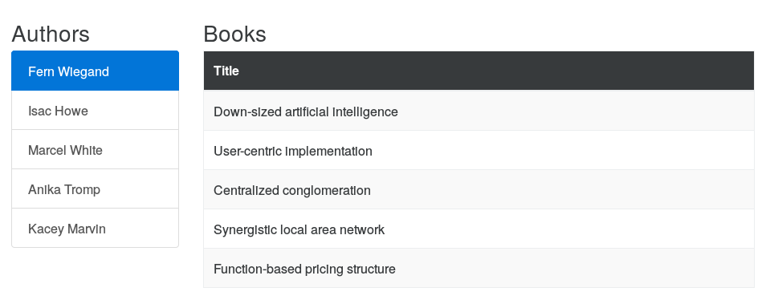

# Ember Book Collection Example

This is a sample Ember application that demonstrates various common patterns
found in modern websites.

The master branch contains the latest update to the application, with tags
provided for specific features. There is an accompanying blog post for each
tag:

* [Model-based sidebars in Ember][1] under tag `model-based-sidebar`

Start the application using `ember server` and the navigate to
[http://localhost:4200/authors/1/books](http://localhost:4200/authors/1/books)
in your browser.

[1]: http://blog.humblecoder.com/model-based-sidebars-in-ember/
