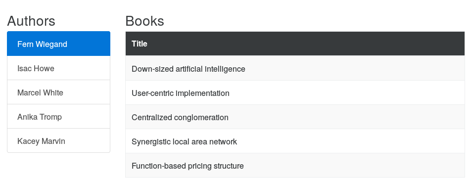

# Ember-model-based-sidebars

This is a sample Ember application to demostrate implementing a sidebar that
displays model data.

An explanation of the implementation can be found in the blog post
[Model-based sidebars in Ember][1].

Start the application using `ember server` and the navigate to
[http://localhost:4200/authors/1/books](http://localhost:4200/authors/1/books)
in your browser.

[1]: http://blog.humblecoder.com/model-based-sidebars-in-ember/
