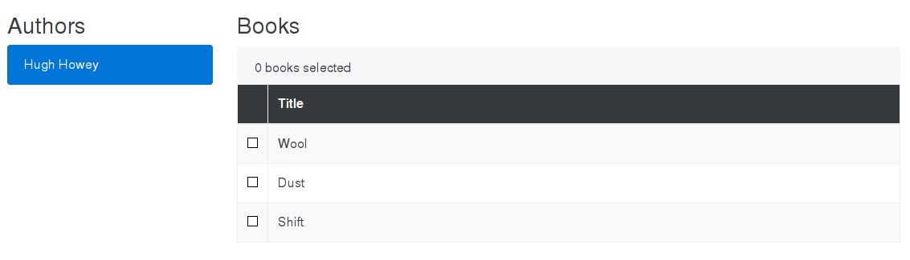

# Bookworm

This is a sample Ember application that demonstrates various common patterns
found in modern websites.

The master branch contains the latest update to the application, with tags
provided for specific features. There is an accompanying blog post for each
tag:

* [How to dockerize and Ember app][3] under the tag `docker`
* [Track table selections in Ember][2] under the tag `track-table-selections`
* [Model-based sidebars in Ember][1] under the tag `model-based-sidebar`

[1]: http://blog.humblecoder.com/model-based-sidebars-in-ember/
[2]: http://blog.humblecoder.com/track-table-selections-in-ember/
[3]: http://blog.humblecoder.com/how-to-dockerize-an-ember-app/

## Running

1. Build: `docker-compose --x-networking build`
2. Run Dev: `docker-compose --x-networking -f docker-compose.yml -f docker-compose-dev.yml up`
3. Run Prod: `docker-compose --x-networking up`

When running in development you need to ensure the dependencies for the
frontend and backend are installed on the host:

* Frontend: `cd frontend && npm install && bower install`
* Backend: `cd backend && npm install`

Navigate to [localhost:4200/authors](http://localhost:4200/authors) in your
browser.
